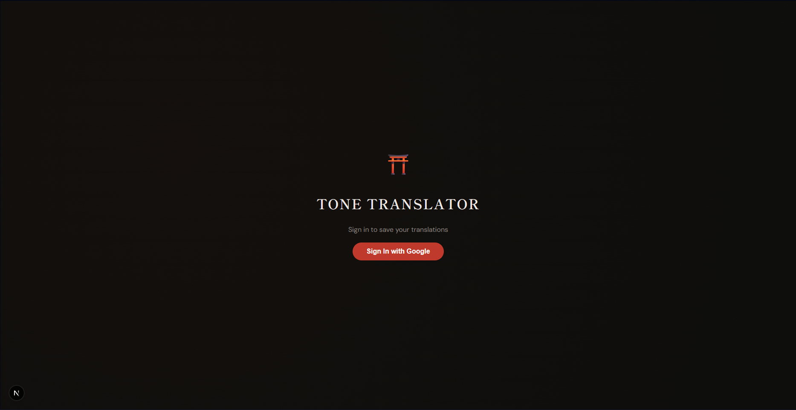
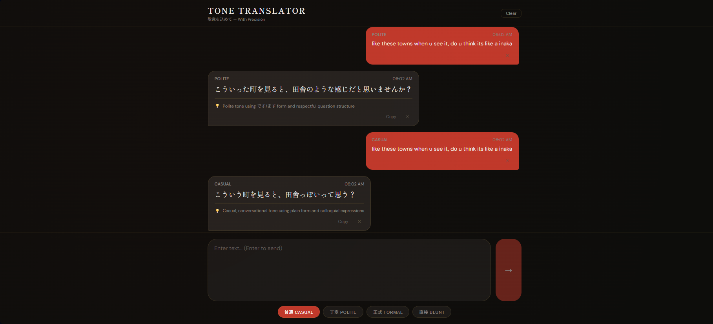
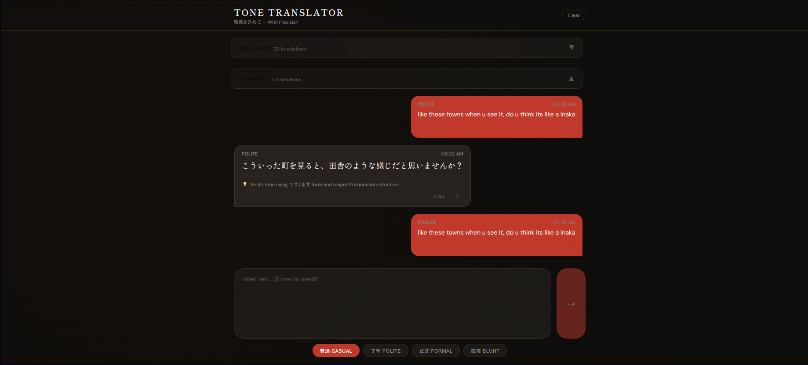

# ⛩️ Tone Translator

> Japanese ↔ English translation that gets the *tone* right — choose a politeness level, translate, or check whether your Japanese is natural.

**Live:** [tone.anthonyta.dev](https://tone.anthonyta.dev)

---

## Screenshots

| Sign in | Translating | History |
|---------|-------------|---------|
|  |  |  |

## What it does

Japanese politeness isn't a single setting — the same sentence can be casual between friends or stiffly formal in a business email, and choosing wrong is the difference between sounding natural and sounding rude. Tone Translator makes that choice explicit: pick a register, translate, and get a note on the cultural nuance behind the output. When writing in Japanese yourself, use the naturalness check to verify your sentence is correct and sounds like something a native speaker would actually say.

## Features

- **Tone control** — four politeness registers: 普通 Casual, 丁寧 Polite, 正式 Formal, 直接 Blunt.
- **Automatic direction detection** — type in either language; it detects the source and translates to the other.
- **Naturalness check** — switch to CHECK mode and verify whether your Japanese (or English) is grammatically correct and natural for the selected register. Returns a ✓ / ⚠ verdict with a brief explanation, and a suggested fix if something is off.
- **Explanations** — every translation includes a short note on the nuance or cultural choice behind it.
- **Chat-style history** — translations and checks flow into a conversation view, grouped by date with collapsible sections and a sticky jump nav when multiple groups exist.
- **Accounts & private history** — sign in and your history is saved to your account across devices.
- **Manage your history** — copy any result, delete individual entries, or clear everything.
- **Japanese-inspired UI** — Mincho serif typography, dark palette, custom CSS design tokens.

## Tech Stack

| Area | Choice |
|------|--------|
| Framework | Next.js 16 (App Router, React 19, Turbopack) |
| Language | TypeScript |
| AI | Haiku 4.5 via Anthropic API — streaming output |
| Auth | Clerk |
| Database | PostgreSQL (Supabase) |
| Styling | CSS design tokens + Tailwind CSS v4 |
| Hosting | Vercel |

## Architecture Highlights

- **Per-user data isolation.** Clerk owns authentication; every row is stamped with the Clerk `userId`, and the API scopes all reads, writes, and deletes to the signed-in user. The server uses Supabase's service-role key while Row-Level Security locks the public key out of the table.
- **Streaming output.** Both the translate and check endpoints stream plain text directly to the client. The translate client splits on a `[[EXPLANATION]]` sentinel; the check client parses the first newline as the verdict/body boundary. Formatting (gold verdict line, smaller body text) is applied from the first character during streaming — no layout snap on completion. Messages are finalized in-place with no visible flash.
- **Optimistic UI.** Your message appears instantly; the streaming assistant message fills in live. The record is persisted to Supabase after streaming completes and the temp ID is swapped for the real DB ID without any visible change.
- **IP rate limiting.** Both endpoints enforce 15 requests/minute per IP using an in-memory fixed-window counter. Vercel's `x-vercel-forwarded-for` header is used instead of `x-forwarded-for` to prevent client-side spoofing.

## CI / Quality

Every push and pull request runs a GitHub Actions pipeline:

1. `npm audit --audit-level=high` — blocks on high/critical dependency vulnerabilities
2. `npx tsc --noEmit` — TypeScript type check
3. `npm run lint` — ESLint
4. `npm test` — Vitest unit tests (translate utilities, input validation, rate limiting, date grouping)
5. `npm run build` — full Next.js production build

Branch protection on `main` requires the pipeline to pass before merging.

---

Built by [Anthony](https://github.com/anthonylhta).
